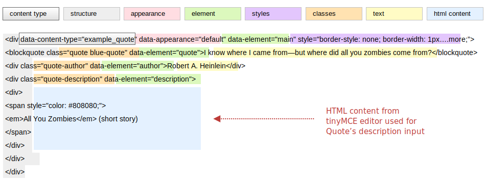
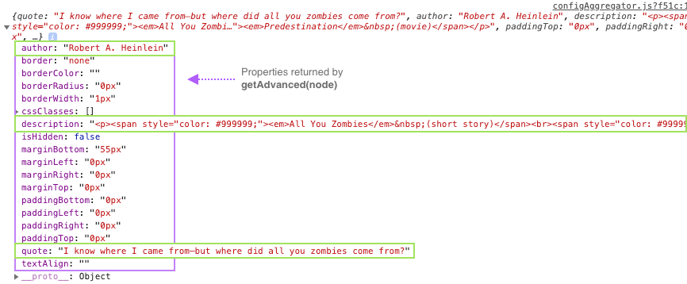

The purpose of the configuration aggregator (configAggregator) is to retrieve properties from a content type's HTML and return those properties as a flat object of `key:values`. The framework (specifically the `<ContentTypeFactory />`) then passes this object to your component, where you can assign the properties to your component's corresponding properties for rendering within a PWA Studio app.


## Content type HTML

The key to building out your aggregator is knowing the structure, content, and properties available in your content type's master format. You can do this the hard way by looking in the database of your Magento instance (specifically, the `content` field in the `cms_page` and `cms_block` tables). But there is a better way.

**Protip**: Place a `console.log(node)` at the top of your `configAggregator` function so you can see exactly what your content type's HTML (the `HTMLElement` passed by the framework) looks like. In the `ExampleQuote` starter code, you would add it as shown here:

```js
export default (node, props) => {
    console.log(node);
    return {
        // Retrieve properties from node here
    };
};
```

The console output should look something like this:


The `node` (HTMLElement) passed to the aggregator contains only your content type's HTML from the master format, not the entire master format as you would find in the database.

## The Aggregator

The interface for a `configAggregator` is:

```ts
(node: HTMLElement, props: {contentType: string, appearance: string}) => {[key: string]: any}
```

### Purpose

To recap, the purpose of your component's aggregator is to collect (aggregate) properties from your content type's HTML and return a property object for use in your component. The object you return should contain all the text, html, inline styles, and classes you need to faithfully reproduce your content type as a component in PWA Studio.

Let's look at our Quote content HTML in detail (color coded for easier analysis) to determine the properties we want to return for our component:



Here's what we think we need for our component:

-   The inline **styles** from the main node
-   The **text** content from the `<blockquote>` and `author` nodes
-   The **HTML** content from the `description` node
-   The CSS **classes** from all three child nodes (`<blockquote>`, `author`, and `description`)

To retrieve these properties, you'll want to use a combination of [HTMLElement DOM properties] along with our [utility functions], as shown next in the example.

### Example aggregator

Here is the aggregator we use for the `ExampleQuote` component:

```js
import { getAdvanced } from '../../utils';

export default (node, props) => {

console.log(node);

    return {
        quote: node.childNodes[0].textContent,
        author: node.childNodes[1].textContent,
        description: node.childNodes[2].innerHTML,
        ...getAdvanced(node)
    };
};
```

First we `import` the utility function(s) we want to use. In our case, we know that our Quote content type provides end users with the Advanced form section. So we import the `getAdvanced` function from `utils.js`.

Then we use the `element` names from the content type HTML (color coded in green above) as our property key names: `quote`, `author`, and `description`. Naming your properties like this helps to identify where the data in the component comes from.

Next, we use the `textContent` and `innerHTML` DOM properties to grab the text and html values from the appropriate `childNodes`.

Finally, we use the `getAdvanced()` utility function to retrieve all the property values from the Advanced section of our content type's form.

{: .bs-callout .bs-callout-info}
The Quote content type also has a form section called Background (from the `pagebuilder_base_form_with_background_attributes` form). This section of the form allows end users to enter all kinds of background attributes, such as images, colors, positions and so on. If your custom content uses the Background section, you should retrieve the those attributes using the `getBackgroundImages(node)` utility function. However, to keep things simple for our component, we decided not to pull these attributes from the HTML.

### Retrieving data from different Appearances

If your content type has different appearances, the HTML for each appearance will also differ. To handle these differences, we provide the `appearance` within the `props` argument so  you can modify your queries in order to retrieve data from the correct node.

For our Quote content type, we only have one appearance (the default); so we do not need to use it. However, the Row content type has three appearances, so it uses a conditional based on the `props.appearance` value to determine the correct node to use, as shown here:

```js
// Targeting appearances in the Row aggregator

export default (node, props) => {
    // Determine which node holds the data for the appearance
    const dataNode =
        props.appearance === 'contained' ? node.childNodes[0] : node;
    return {
        minHeight: dataNode.style.minHeight ? dataNode.style.minHeight : null,
        ...
    };
```

## Test the aggregator

The best way to see the properties returned by your aggregator is using `console.log()`. For our Quote aggregator, we can do something like this:

```js
import { getAdvanced, getCssClasses, getBackgroundImages } from '../../utils';

export default (node, props) => {
    console.log(node);

    const propObject = {
        quote: node.childNodes[0].textContent,
        author: node.childNodes[1].textContent,
        description: node.childNodes[2].innerHTML,
        ...getAdvanced(node)
    };

    console.log(propObject);
    return propObject;
};
```

Adding `console.log(node)` at the beginning of your aggregator function, and at he end (`console.log(propObject)`), helps to show you the HTML you receive and the object you return. The property object returned from our aggregator looks like this:



{: .bs-callout .bs-callout-info}
You will need to know the property `key-values` you are returning so that that you can assign them to corresponding properties in your component when you build it out.

[utility functions]: {{ site.baseurl }}
[HTMLElement DOM properties]: https://developer.mozilla.org/en-US/docs/Web/API/HTMLElement
