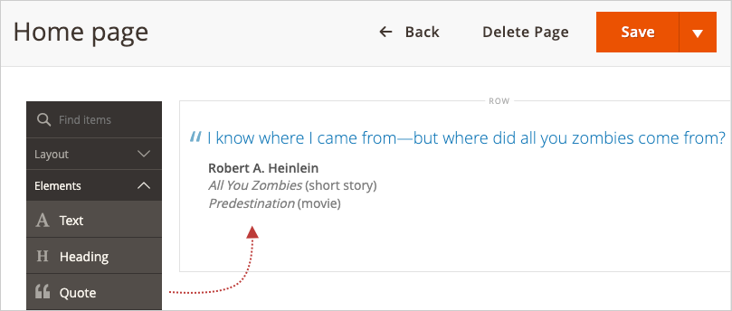
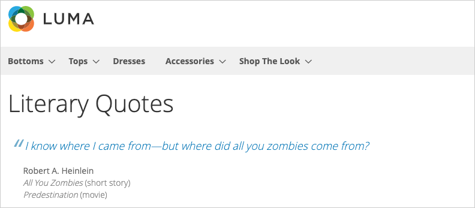

<!--  -->
Let's assume you have at least one _custom_ Page Builder content type rendering content on your Magento storefront. But now you want that content to show up in your PWA app as well. What do you do? Short answer: You create a custom PWA Page Builder component (also know as a "content type component"). The long answer is described in this series of topics. The steps shown here describe the recommended process for developing content type components:

The topics for these steps show you how to create the code that retrieves properties (content and styling) from your content type HTML (in the configAggregator) and assign those properties to the equivalent properties in your in content type component.
<!--  -->

## Prerequisites

Before you start creating your custom content type component in PWA Studio, make sure you have met the following prerequisites:

-   Your Magento instance should have a custom content type added and saved to the **home** page in the Admin. Currently, the `home` page is the only page you can render Page Builder content within PWA Studio.
-   Your Magento instance should render this content type on the home page of your storefront.

{: .bs-callout .bs-callout-info}
We assume you already have the PWA Studio set up and running in your development environment. If you do not, [use these instructions] to do that now.

## Using the Quote content type

To help explain the process of creating a custom Page Builder component, we frequently refer to a component called `ExampleQuote`. We built this component as the PWA counterpart to the example Quote content type found on the [GitHub pagebuilder-examples repo].

If you want to follow along with these topics more closely, [download and install the PageBuilderQuote module] in your Magento instance and use it to fulfill the prerequisites previously mentioned.

## Home page in Admin

The first prerequisite is to add and save your custom content type to your Magento Home page in Admin. Here we see the Quote content type saved to the Home page in the Admin:

## Home page on Storefront

The second prerequisite is to ensure that your custom content type renders successfully in the storefront of your Magento instance. Here we see the Quote content type rendered on the Home page of a Luma storefront:

After you have met these prerequisites, you are ready to begin creating your custom Page Builder component in the PWA Studio.

[download and install the PageBuilderQuote module]: https://github.com/magento-devdocs/pagebuilder-examples/tree/master/Example/PageBuilderQuote
[GitHub pagebuilder-examples repo]: https://github.com/magento-devdocs/pagebuilder-examples/tree/master/Example/PageBuilderQuote
[use these instructions]: {{ site.baseurl }}
